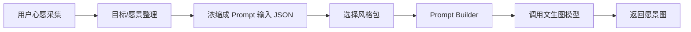

# 心愿愿景板文生图 Prompt 模板（v0）

更新时间：2026-05-10

## 1. 设计思路

这个 Prompt 模板用于第一阶段测试。当前前端心愿采集流程还没有完全确定，所以先按照“倒推生成质量”的方式设计：

1. 先定义最终图片应该长什么样。
2. 再反推生成高质量图片需要哪些字段。
3. 最后把这些字段浓缩进稳定的 Prompt 模板。

愿景板图片的目标不是简单把用户输入画出来，而是把用户的心愿转化成一个“理想状态”的视觉画面。图片需要有情绪、有主体、有场景、有高级感，同时避免水印、乱码文字、杂乱构图和过度抽象。

当前重点先放在“Prompt 模板 -> 生图 API -> 图片结果”这段。前面的心愿采集可以先用模拟数据代替，等前端流程确定后再替换输入字段。

## 2. 从心愿采集到生图的流程



第一阶段可以先跳过真实心愿采集，直接手写一份模拟 JSON：

```json
{
  "rawWish": "我想三个月内养成规律健身习惯，也希望整个人状态更好、更自信。",
  "visionSummary": "A disciplined wellness lifestyle with a confident, healthy, glowing future self.",
  "desiredState": "confident, energetic, healthy, self-controlled, elegant",
  "category": "health",
  "keywords": ["wellness", "self-discipline", "glowing skin", "morning routine", "fitness"],
  "sceneKeywords": ["bright bedroom", "pilates studio", "green smoothie", "morning sunlight"],
  "stylePack": "clean-girl-luxury",
  "aspectRatio": "16:9"
}
```

后续前端交互确定后，只要能产出类似结构，就可以直接替换模拟输入。

## 3. 心愿采集范围草案

前端最终不一定要问完所有问题。这里先列出可能有用的采集范围，后续根据体验压缩。

### 目标本身

- 你现在最想实现的一个心愿是什么？
- 这个心愿属于哪类：变美/健康/事业/财富/爱情/旅行/学习/疗愈/生活方式？
- 这个目标有没有时间范围：一个月、三个月、一年、长期？

### 理想状态

- 如果这个心愿实现了，你希望自己处在什么状态？
- 你想拥有怎样的生活画面？
- 你希望别人如何感受到你的变化？

### 情绪与关键词

- 你希望这张图带给你什么感觉：自信、松弛、浪漫、富足、自由、稳定、治愈？
- 请选 3-5 个关键词描述这个愿景。
- 有没有一定要出现的元素：海边、办公室、鲜花、咖啡、健身房、旅行、城市夜景？

### 边界与禁忌

- 有没有不想出现在画面里的东西？
- 是否需要避免过于夸张、广告感、网红感、阴暗感？
- 图片上是否需要文字？第一阶段建议不让模型生成文字，由前端叠加。

## 4. 浓缩后的 Prompt 输入字段

前端或上一步目标拆解模块最终需要把大段输入浓缩成下面这些字段：

```ts
type VisionPromptInput = {
  rawWish: string;
  visionSummary: string;
  desiredState: string;
  category?: "beauty" | "health" | "career" | "wealth" | "love" | "travel" | "healing" | "study" | "lifestyle";
  keywords?: string[];
  sceneKeywords?: string[];
  avoid?: string[];
  stylePack: keyof typeof visionStylePacks;
  aspectRatio?: "1:1" | "16:9" | "9:16";
};
```

字段说明：

| 字段 | 说明 | 第一阶段是否必需 |
| --- | --- | --- |
| `rawWish` | 用户原始心愿，保留原始语义 | 必需 |
| `visionSummary` | 后端或前置流程总结出的英文视觉愿景 | 必需 |
| `desiredState` | 目标实现后的理想状态 | 必需 |
| `category` | 心愿分类，用于选择默认风格或元素 | 可选 |
| `keywords` | 抽象关键词，如 self-discipline、wealth、romance | 可选 |
| `sceneKeywords` | 具体画面元素，如 ocean、office、flowers | 可选 |
| `avoid` | 用户不想要的元素 | 可选 |
| `stylePack` | 预设风格包 | 必需 |
| `aspectRatio` | 图片比例，Web 默认 `16:9` | 可选 |

## 5. 预设风格包

你提供的风格包有重复项，这里去重后整理为 5 个可直接给后端使用的 preset。

注意：部分风格描述里包含 `elegant serif typography`。如果最终图片由前端叠加文字，Prompt 里需要写成 “typography-inspired layout, no readable text”，避免模型生成乱码英文。

```ts
const visionStylePacks = {
  "clean-girl-luxury": {
    label: "Clean Girl 轻奢显化风",
    suitableFor: ["变美", "健康", "自律", "财富", "旅行"],
    stylePrompt:
      "clean girl aesthetic, soft luxury, cream white and beige palette, glowing skin, white outfits, wellness lifestyle, minimal luxury, Pinterest moodboard, feminine and refined, typography-inspired editorial layout but no readable text",
    moodPrompt:
      "clean, elegant, self-disciplined, glowing, abundant, calm confidence",
    defaultScenes:
      "morning sunlight, white bedroom, pilates studio, skincare table, green smoothie, luxury wellness lifestyle"
  },
  "ceo-career-woman": {
    label: "CEO Career Woman 风",
    suitableFor: ["事业", "升职", "创业", "职场成功"],
    stylePrompt:
      "female CEO energy, luxury office, business outfit, laptop, coffee, city view apartment, financial success, black white beige palette, editorial magazine collage, elegant and ambitious",
    moodPrompt:
      "ambitious, focused, powerful, elegant, financially successful",
    defaultScenes:
      "luxury office, city view apartment, laptop, coffee, business outfit, clean desk, financial success atmosphere"
  },
  "lucky-girl-romantic": {
    label: "Lucky Girl 浪漫好运风",
    suitableFor: ["爱情", "好运", "疗愈", "幸福生活"],
    stylePrompt:
      "lucky girl syndrome, soft feminine energy, romantic lifestyle, flowers, sunlight, couple moments, champagne beige and blush pink palette, dreamy Pinterest collage, elegant serif typography-inspired layout but no readable text",
    moodPrompt:
      "romantic, lucky, soft, healed, loved, dreamy, emotionally safe",
    defaultScenes:
      "flowers, sunlight, romantic table, soft bedroom, cafe, champagne beige and blush pink details"
  },
  "travel-freedom": {
    label: "Travel Freedom 度假自由风",
    suitableFor: ["旅行", "自由生活", "远程办公", "松弛感"],
    stylePrompt:
      "travel freedom, luxury vacation, ocean, island, snowy mountains, airplane window, cruise, resort breakfast, blue white beige palette, cinematic lifestyle collage",
    moodPrompt:
      "free, relaxed, expansive, peaceful, adventurous, effortless",
    defaultScenes:
      "ocean, island, airplane window, cruise, resort breakfast, snowy mountains, remote work by the sea"
  },
  "old-money-life": {
    label: "Old Money 高级人生风",
    suitableFor: ["高级感", "气质", "财富", "稳定生活"],
    stylePrompt:
      "old money aesthetic, quiet luxury, cream beige navy and gold palette, elegant outfits, tennis, golf, classic jewelry, luxury hotel, refined lifestyle, editorial collage",
    moodPrompt:
      "quiet luxury, refined, stable, wealthy, elegant, timeless",
    defaultScenes:
      "classic jewelry, luxury hotel, tennis court, golf club, elegant outfits, navy and gold details"
  }
};
```

## 6. Prompt 模板 v0

建议后端先用英文 Prompt。大多数图像模型对英文视觉描述更稳定，中文用户输入可以保留原意，但核心视觉描述尽量用英文。

```text
Create a high-quality aspirational vision board image based on the user's personal wish.

The image should visualize the user's ideal future state, not the current struggle.
It should feel like a premium Pinterest-style vision board image, with clear lifestyle aspiration and emotional direction.

Original user wish:
{{rawWish}}

Condensed visual vision:
{{visionSummary}}

Desired future state:
{{desiredState}}

Core keywords:
{{keywords}}

Suggested visual scenes and objects:
{{sceneKeywords}}

Selected style package:
{{styleLabel}}

Visual style:
{{stylePrompt}}

Mood and emotion:
{{moodPrompt}}

Default style scenes:
{{defaultScenes}}

Composition requirements:
- premium aspirational lifestyle image
- clear visual hierarchy
- strong central theme
- refined Pinterest moodboard feeling
- elegant editorial composition
- clean and beautiful color palette
- suitable for a large web vision board card or hero image
- visually rich but not messy
- no readable text; any typography should be abstract or implied only

Avoid:
- readable text
- watermark
- logo
- UI elements
- distorted faces
- distorted hands
- low-quality stock photo feeling
- messy collage
- cheap advertisement look
- dark or depressing mood
- cluttered background
{{avoid}}

Output:
Generate one polished image in {{aspectRatio}} aspect ratio.
```

## 7. 后端 Prompt Builder 示例

```ts
type VisionPromptInput = {
  rawWish: string;
  visionSummary: string;
  desiredState: string;
  category?: "beauty" | "health" | "career" | "wealth" | "love" | "travel" | "healing" | "study" | "lifestyle";
  keywords?: string[];
  sceneKeywords?: string[];
  avoid?: string[];
  stylePack?: keyof typeof visionStylePacks;
  aspectRatio?: "1:1" | "16:9" | "9:16";
};

function buildVisionBoardPrompt(input: VisionPromptInput) {
  const stylePack =
    visionStylePacks[input.stylePack ?? "clean-girl-luxury"];

  return `
Create a high-quality aspirational vision board image based on the user's personal wish.

The image should visualize the user's ideal future state, not the current struggle.
It should feel like a premium Pinterest-style vision board image, with clear lifestyle aspiration and emotional direction.

Original user wish:
${input.rawWish}

Condensed visual vision:
${input.visionSummary}

Desired future state:
${input.desiredState}

Core keywords:
${input.keywords?.join(", ") ?? "personal growth, ideal future self, aspirational lifestyle"}

Suggested visual scenes and objects:
${input.sceneKeywords?.join(", ") ?? stylePack.defaultScenes}

Selected style package:
${stylePack.label}

Visual style:
${stylePack.stylePrompt}

Mood and emotion:
${stylePack.moodPrompt}

Default style scenes:
${stylePack.defaultScenes}

Composition requirements:
- premium aspirational lifestyle image
- clear visual hierarchy
- strong central theme
- refined Pinterest moodboard feeling
- elegant editorial composition
- clean and beautiful color palette
- suitable for a large web vision board card or hero image
- visually rich but not messy
- no readable text; any typography should be abstract or implied only

Avoid:
- readable text
- watermark
- logo
- UI elements
- distorted faces
- distorted hands
- low-quality stock photo feeling
- messy collage
- cheap advertisement look
- dark or depressing mood
- cluttered background
${input.avoid?.map((item) => `- ${item}`).join("\n") ?? ""}

Output:
Generate one polished image in ${input.aspectRatio ?? "16:9"} aspect ratio.
`.trim();
}
```

## 8. 模拟生成器接口建议

第一阶段可以先做一个“文生图模拟生成器”，不依赖前端最终心愿采集。

### 请求

```json
{
  "rawWish": "我想三个月内养成规律健身习惯，也希望整个人状态更好、更自信。",
  "visionSummary": "A disciplined wellness lifestyle with a confident, healthy, glowing future self.",
  "desiredState": "confident, energetic, healthy, self-controlled, elegant",
  "category": "health",
  "keywords": ["wellness", "self-discipline", "glowing skin", "morning routine", "fitness"],
  "sceneKeywords": ["bright bedroom", "pilates studio", "green smoothie", "morning sunlight"],
  "stylePack": "clean-girl-luxury",
  "aspectRatio": "16:9"
}
```

### 响应

```json
{
  "image": "data:image/png;base64,...",
  "prompt": "Create a high-quality aspirational vision board image..."
}
```

接口可以暂定为：

```text
POST /api/generate-image
```

这样前端没有定稿时，也可以先用固定 JSON 测试不同风格包的生成质量。

## 9. 测试样例

### Clean Girl 轻奢显化风

```json
{
  "rawWish": "我想变得更健康、更自律，也希望自己的状态越来越好。",
  "visionSummary": "A soft luxury wellness lifestyle with a glowing, disciplined, confident future self.",
  "desiredState": "glowing, healthy, elegant, self-disciplined, abundant",
  "category": "health",
  "keywords": ["clean girl", "wellness", "self-discipline", "glowing skin", "soft luxury"],
  "sceneKeywords": ["white outfit", "morning sunlight", "pilates studio", "green smoothie", "cream white bedroom"],
  "stylePack": "clean-girl-luxury",
  "aspectRatio": "16:9"
}
```

### CEO Career Woman 风

```json
{
  "rawWish": "我想在事业上更进一步，成为能独立负责项目、收入稳定增长的人。",
  "visionSummary": "An ambitious female career vision with financial success, leadership, and elegant professional confidence.",
  "desiredState": "focused, successful, professional, confident, financially abundant",
  "category": "career",
  "keywords": ["female CEO energy", "career success", "financial success", "leadership", "luxury office"],
  "sceneKeywords": ["city view apartment", "luxury office", "laptop", "coffee", "business outfit"],
  "stylePack": "ceo-career-woman",
  "aspectRatio": "16:9"
}
```

### Lucky Girl 浪漫好运风

```json
{
  "rawWish": "我希望生活更顺利，遇到好的关系，也慢慢变得更幸福。",
  "visionSummary": "A romantic lucky girl lifestyle filled with love, softness, healing, sunlight, and beautiful everyday moments.",
  "desiredState": "loved, lucky, peaceful, romantic, emotionally fulfilled",
  "category": "love",
  "keywords": ["lucky girl syndrome", "romantic lifestyle", "soft feminine energy", "healing", "happiness"],
  "sceneKeywords": ["flowers", "sunlight", "romantic cafe", "blush pink details", "couple moments"],
  "stylePack": "lucky-girl-romantic",
  "aspectRatio": "16:9"
}
```

### Travel Freedom 度假自由风

```json
{
  "rawWish": "我想拥有更自由的生活，可以旅行、远程办公，也能保持松弛感。",
  "visionSummary": "A cinematic freedom lifestyle with luxury travel, ocean views, relaxed remote work, and expansive life choices.",
  "desiredState": "free, relaxed, adventurous, peaceful, independent",
  "category": "travel",
  "keywords": ["travel freedom", "luxury vacation", "remote work", "ocean", "relaxed lifestyle"],
  "sceneKeywords": ["airplane window", "ocean", "resort breakfast", "island", "laptop by the sea"],
  "stylePack": "travel-freedom",
  "aspectRatio": "16:9"
}
```

### Old Money 高级人生风

```json
{
  "rawWish": "我想拥有更稳定、更高级、更有质感的生活状态。",
  "visionSummary": "A refined old money lifestyle with quiet luxury, stable wealth, elegant taste, and timeless confidence.",
  "desiredState": "stable, wealthy, refined, elegant, timeless",
  "category": "wealth",
  "keywords": ["old money aesthetic", "quiet luxury", "refined lifestyle", "wealth", "elegance"],
  "sceneKeywords": ["luxury hotel", "classic jewelry", "tennis", "golf", "navy and gold palette"],
  "stylePack": "old-money-life",
  "aspectRatio": "16:9"
}
```

## 10. Prompt 调优原则

如果生成结果不稳定，优先调整 Prompt，而不是马上换模型。

调优顺序：

1. 先明确愿景：用户到底想成为什么状态。
2. 再明确风格包：走轻奢、事业、好运、旅行还是 old money。
3. 再明确具体画面元素：办公室、海边、鲜花、咖啡、健身房、旅行等。
4. 再限制负面元素：不要文字、水印、logo、杂乱背景。
5. 最后才调模型参数：尺寸、质量、格式。

常见问题：

| 问题 | 调整方式 |
| --- | --- |
| 画面太抽象 | 增加 `sceneKeywords`，例如 luxury office、ocean、pilates studio |
| 画面太像广告 | 加入 premium but natural, not commercial advertisement |
| 文字乱码 | 强化 no readable text, no typography, no signs |
| 拼贴太乱 | 加入 visually rich but not messy, clear visual hierarchy |
| 风格不明显 | 强化 `stylePrompt`，增加调色板和具体生活方式元素 |
| 情绪太压抑 | 加入 bright, hopeful, emotionally positive |
| 主体不清晰 | 加入 strong central theme, clear visual hierarchy |

## 11. 后续需要前端确认的问题

前端交互确定后，需要反推 Prompt 字段：

- 用户输入是一句话，还是分步骤问答？
- 是否让用户选择心愿分类？
- 是否让用户选择这 5 个风格包？
- 是否让用户选择情绪关键词？
- 是否让用户选择具体画面元素？
- 是否需要生成一张主图，还是多张愿景板拼图？
- 图片上是否叠加前端文字？
- 输出比例是固定 `16:9`，还是根据卡片布局变化？
- 是否需要用户点击“再生成一张”？

这些问题确定后，再把 v0 模板升级成 v1。

## 12. 当前建议

第一阶段先用这个模板测试 5 个风格包，每个风格包至少测试 2 个心愿。

测试时记录：

- 用户原始心愿
- 浓缩后的 `visionSummary`
- 使用的 `stylePack`
- 最终 Prompt
- 模型名称
- 图片是否符合预期
- 失败原因
- 需要调整的字段

等前端交互定下来，再决定哪些字段必须由前端收集，哪些字段由后端自动补全。
