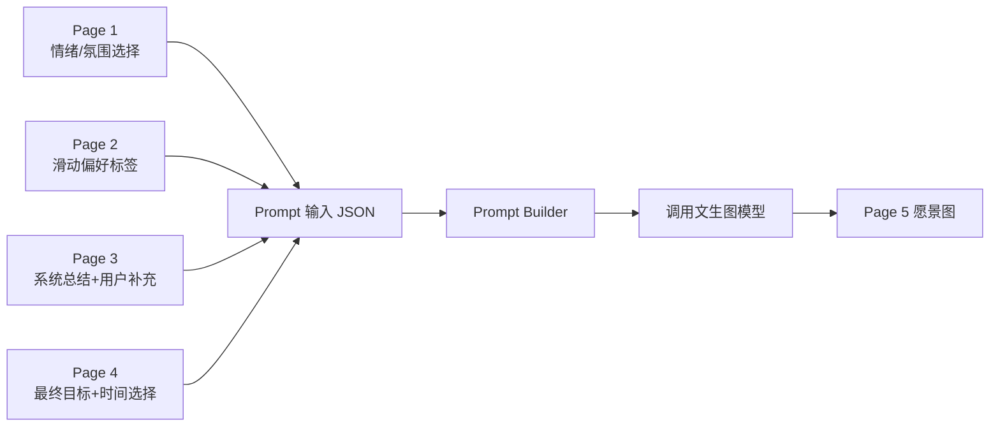

# 心愿愿景板文生图 Prompt 模板（v1）

更新时间：2026-05-10

## 1. 设计思路

这个 Prompt 模板基于已确定的六步交互流程（PRD v2026-05-10）设计。前端心愿采集分为四个数据收集页：

```text
Page 1 情绪氛围 -> Page 2 滑动偏好 -> Page 3 系统总结+补充 -> Page 4 最终目标+时间
```

每一页的输出都会汇入最终的 Prompt 输入 JSON，再填入固定模板，调用文生图模型。

愿景板图片的目标：把用户的心愿转化成"理想状态"的视觉画面。图片需要有情绪、有主体、有场景、有高级感，同时避免水印、乱码文字、杂乱构图和过度抽象。

## 2. 从心愿采集到生图的流程



## 3. 最终 Prompt 输入结构

在 Page 4 用户点击生成后，系统合并前面所有信息，生成如下结构：

```json
{
  "rawWish": "我希望不要太网红，更自然一点，也希望有富足感。",
  "visionSummary": "A disciplined wellness lifestyle with a confident, healthy, glowing future self.",
  "selectedVisionOptions": [
    "建立稳定、自律、发光的生活节奏",
    "拥有更富足、更松弛、更高级的日常状态"
  ],
  "goalOutcome": "build a stable wellness and self-discipline routine within three months",
  "timeframe": "3 months",
  "desiredState": "confident, glowing, relaxed, self-disciplined, abundant",
  "keywords": ["wellness", "self-discipline", "soft luxury", "morning routine"],
  "sceneKeywords": ["morning sunlight", "pilates studio", "green smoothie", "white bedroom"],
  "stylePack": "clean-girl-luxury",
  "moodPrompt": "bright, clean, elegant, hopeful, abundant",
  "avoid": ["readable text", "logo", "dark mood", "messy collage", "too influencer-like"],
  "aspectRatio": "16:9"
}
```

## 4. Prompt 字段来源映射

| Prompt 字段 | 来源页面 | 说明 |
| --- | --- | --- |
| `rawWish` | Page 3 用户补充 + 前面选择结果 | 保留用户自己的愿望表达 |
| `visionSummary` | Page 4 目标选项合并总结 | 最重要字段，决定愿景图主题 |
| `selectedVisionOptions` | Page 4 用户多选的条状目标选项 | 作为最终愿景方向基础 |
| `goalOutcome` | Page 4 最终目标 + 时间范围 | 让目标更具体 |
| `timeframe` | Page 4 时间选择 | 用于目标总结，不直接影响画面 |
| `desiredState` | Page 1 情绪词 + Page 2 状态卡 + Page 4 AI 总结 | 决定图片情绪核心 |
| `keywords` | Page 1 + Page 2 + Page 3 | 抽象关键词，如 self-discipline、freedom |
| `sceneKeywords` | Page 2 画面元素卡 | 决定图片里出现的具体元素 |
| `stylePack` | Page 2 风格信号 + Page 4 推荐 | 决定整体审美 |
| `moodPrompt` | Page 1 情绪氛围选择 | 控制画面氛围 |
| `avoid` | Page 2 左滑卡片 + Page 3 用户修正 + 默认规则 | 避免用户不喜欢的方向 |
| `aspectRatio` | 系统默认 | Web 端 `16:9`，手机壁纸 `9:16` |

## 5. 浓缩后的 Prompt 输入字段

```ts
type VisionPromptInput = {
  rawWish: string;
  visionSummary: string;
  selectedVisionOptions: string[];
  goalOutcome: string;
  timeframe: string;
  desiredState: string;
  keywords?: string[];
  sceneKeywords?: string[];
  stylePack: keyof typeof visionStylePacks;
  moodPrompt?: string;
  avoid?: string[];
  aspectRatio?: "1:1" | "16:9" | "9:16";
};
```

字段说明：

| 字段 | 说明 | 是否必需 |
| --- | --- | --- |
| `rawWish` | 用户原始心愿补充，保留原始语义 | 必需 |
| `visionSummary` | 系统总结出的英文视觉愿景 | 必需 |
| `selectedVisionOptions` | 用户在 Page 4 多选的愿景方向（1-2 个） | 必需 |
| `goalOutcome` | 结合目标和时间范围的具体表述 | 必需 |
| `timeframe` | 达成时间，如 3 months、1 year | 必需 |
| `desiredState` | 目标实现后的理想状态，如 confident, glowing | 必需 |
| `keywords` | 抽象关键词，如 self-discipline、freedom、abundance | 可选 |
| `sceneKeywords` | 具体画面元素，如 ocean、pilates studio、flowers | 可选 |
| `stylePack` | 预设风格包 | 必需 |
| `moodPrompt` | 画面情绪氛围，来自 Page 1 用户选择 | 可选 |
| `avoid` | 用户不想要的元素 | 可选 |
| `aspectRatio` | 图片比例，Web 默认 `16:9` | 可选 |

## 6. 预设风格包

```ts
const visionStylePacks = {
  "clean-girl-luxury": {
    label: "Clean Girl 轻奢显化风",
    suitableFor: ["变美", "健康", "自律", "财富", "旅行"],
    stylePrompt:
      "clean girl aesthetic, soft luxury, cream white and beige palette, glowing skin, white outfits, wellness lifestyle, minimal luxury, Pinterest moodboard, feminine and refined, typography-inspired editorial layout but no readable text",
    moodDefault:
      "clean, elegant, self-disciplined, glowing, abundant, calm confidence",
    defaultScenes:
      "morning sunlight, white bedroom, pilates studio, skincare table, green smoothie, luxury wellness lifestyle"
  },
  "ceo-career-woman": {
    label: "CEO Career Woman 风",
    suitableFor: ["事业", "升职", "创业", "职场成功"],
    stylePrompt:
      "female CEO energy, luxury office, business outfit, laptop, coffee, city view apartment, financial success, black white beige palette, editorial magazine collage, elegant and ambitious",
    moodDefault:
      "ambitious, focused, powerful, elegant, financially successful",
    defaultScenes:
      "luxury office, city view apartment, laptop, coffee, business outfit, clean desk, financial success atmosphere"
  },
  "lucky-girl-romantic": {
    label: "Lucky Girl 浪漫好运风",
    suitableFor: ["爱情", "好运", "疗愈", "幸福生活"],
    stylePrompt:
      "lucky girl syndrome, soft feminine energy, romantic lifestyle, flowers, sunlight, couple moments, champagne beige and blush pink palette, dreamy Pinterest collage, elegant serif typography-inspired layout but no readable text",
    moodDefault:
      "romantic, lucky, soft, healed, loved, dreamy, emotionally safe",
    defaultScenes:
      "flowers, sunlight, romantic table, soft bedroom, cafe, champagne beige and blush pink details"
  },
  "travel-freedom": {
    label: "Travel Freedom 度假自由风",
    suitableFor: ["旅行", "自由生活", "远程办公", "松弛感"],
    stylePrompt:
      "travel freedom, luxury vacation, ocean, island, snowy mountains, airplane window, cruise, resort breakfast, blue white beige palette, cinematic lifestyle collage",
    moodDefault:
      "free, relaxed, expansive, peaceful, adventurous, effortless",
    defaultScenes:
      "ocean, island, airplane window, cruise, resort breakfast, snowy mountains, remote work by the sea"
  },
  "old-money-life": {
    label: "Old Money 高级人生风",
    suitableFor: ["高级感", "气质", "财富", "稳定生活"],
    stylePrompt:
      "old money aesthetic, quiet luxury, cream beige navy and gold palette, elegant outfits, tennis, golf, classic jewelry, luxury hotel, refined lifestyle, editorial collage",
    moodDefault:
      "quiet luxury, refined, stable, wealthy, elegant, timeless",
    defaultScenes:
      "classic jewelry, luxury hotel, tennis court, golf club, elegant outfits, navy and gold details"
  }
};
```

## 7. Prompt 模板 v1

建议后端先用英文 Prompt。大多数图像模型对英文视觉描述更稳定，中文用户输入可以保留原意，但核心视觉描述尽量用英文。

```text
Create a high-quality aspirational vision board image based on the user's personal wish.

The image should visualize the user's ideal future state, not the current struggle.
It should feel like a premium Pinterest-style vision board image, with clear lifestyle aspiration and emotional direction.

Original user wish:
{{rawWish}}

Condensed visual vision:
{{visionSummary}}

User's chosen vision directions:
{{selectedVisionOptions}}

Goal outcome:
{{goalOutcome}}

Desired future state:
{{desiredState}}

Core keywords:
{{keywords}}

Suggested visual scenes and objects:
{{sceneKeywords}}

Selected style package:
{{styleLabel}}

Visual style:
{{stylePrompt}}

Mood and emotion:
{{moodPrompt}}

Default style scenes:
{{defaultScenes}}

Composition requirements:
- premium aspirational lifestyle image
- clear visual hierarchy
- strong central theme
- refined Pinterest moodboard feeling
- elegant editorial composition
- clean and beautiful color palette
- suitable for a large web vision board card or hero image
- visually rich but not messy
- no readable text; any typography should be abstract or implied only

Avoid:
- readable text
- watermark
- logo
- UI elements
- distorted faces
- distorted hands
- low-quality stock photo feeling
- messy collage
- cheap advertisement look
- dark or depressing mood
- cluttered background
{{avoid}}

Output:
Generate one polished image in {{aspectRatio}} aspect ratio.
```

## 8. 后端 Prompt Builder

```ts
type VisionPromptInput = {
  rawWish: string;
  visionSummary: string;
  selectedVisionOptions: string[];
  goalOutcome: string;
  timeframe: string;
  desiredState: string;
  keywords?: string[];
  sceneKeywords?: string[];
  stylePack?: keyof typeof visionStylePacks;
  moodPrompt?: string;
  avoid?: string[];
  aspectRatio?: "1:1" | "16:9" | "9:16";
};

function buildVisionBoardPrompt(input: VisionPromptInput): string {
  const stylePack = visionStylePacks[input.stylePack ?? "clean-girl-luxury"];
  const moodPrompt = input.moodPrompt ?? stylePack.moodDefault;
  const avoidLines = input.avoid?.map((item) => `- ${item}`).join("\n") ?? "";

  return `
Create a high-quality aspirational vision board image based on the user's personal wish.

The image should visualize the user's ideal future state, not the current struggle.
It should feel like a premium Pinterest-style vision board image, with clear lifestyle aspiration and emotional direction.

Original user wish:
${input.rawWish}

Condensed visual vision:
${input.visionSummary}

User's chosen vision directions:
${input.selectedVisionOptions.join("; ")}

Goal outcome:
${input.goalOutcome}

Desired future state:
${input.desiredState}

Core keywords:
${input.keywords?.join(", ") ?? "personal growth, ideal future self, aspirational lifestyle"}

Suggested visual scenes and objects:
${input.sceneKeywords?.join(", ") ?? stylePack.defaultScenes}

Selected style package:
${stylePack.label}

Visual style:
${stylePack.stylePrompt}

Mood and emotion:
${moodPrompt}

Default style scenes:
${stylePack.defaultScenes}

Composition requirements:
- premium aspirational lifestyle image
- clear visual hierarchy
- strong central theme
- refined Pinterest moodboard feeling
- elegant editorial composition
- clean and beautiful color palette
- suitable for a large web vision board card or hero image
- visually rich but not messy
- no readable text; any typography should be abstract or implied only

Avoid:
- readable text
- watermark
- logo
- UI elements
- distorted faces
- distorted hands
- low-quality stock photo feeling
- messy collage
- cheap advertisement look
- dark or depressing mood
- cluttered background
${avoidLines}

Output:
Generate one polished image in ${input.aspectRatio ?? "16:9"} aspect ratio.
`.trim();
}
```

## 9. 模拟生成器接口建议

### 请求

```json
{
  "rawWish": "我希望不要太网红，更自然一点，也希望有富足感。",
  "visionSummary": "A disciplined wellness lifestyle with a confident, healthy, glowing future self.",
  "selectedVisionOptions": [
    "建立稳定、自律、发光的生活节奏",
    "拥有更富足、更松弛、更高级的日常状态"
  ],
  "goalOutcome": "build a stable wellness and self-discipline routine within three months",
  "timeframe": "3 months",
  "desiredState": "confident, glowing, relaxed, self-disciplined, abundant",
  "keywords": ["wellness", "self-discipline", "soft luxury", "morning routine"],
  "sceneKeywords": ["morning sunlight", "pilates studio", "green smoothie", "white bedroom"],
  "stylePack": "clean-girl-luxury",
  "moodPrompt": "bright, clean, elegant, hopeful, abundant",
  "avoid": ["too influencer-like", "cheap advertisement look"],
  "aspectRatio": "16:9"
}
```

### 响应

```json
{
  "image": "data:image/png;base64,...",
  "prompt": "Create a high-quality aspirational vision board image..."
}
```

接口：

```text
POST /api/generate-image
```

## 10. 测试样例

### Clean Girl 轻奢显化风

```json
{
  "rawWish": "我想变得更健康、更自律，也希望自己的状态越来越好。",
  "visionSummary": "A soft luxury wellness lifestyle with a glowing, disciplined, confident future self.",
  "selectedVisionOptions": [
    "建立稳定、自律、发光的生活节奏"
  ],
  "goalOutcome": "build a consistent morning wellness routine within three months",
  "timeframe": "3 months",
  "desiredState": "glowing, healthy, elegant, self-disciplined, abundant",
  "keywords": ["clean girl", "wellness", "self-discipline", "glowing skin", "soft luxury"],
  "sceneKeywords": ["white outfit", "morning sunlight", "pilates studio", "green smoothie", "cream white bedroom"],
  "stylePack": "clean-girl-luxury",
  "moodPrompt": "bright, clean, elegant, hopeful",
  "avoid": ["too dark", "cluttered"],
  "aspectRatio": "16:9"
}
```

### CEO Career Woman 风

```json
{
  "rawWish": "我想在事业上更进一步，成为能独立负责项目、收入稳定增长的人。",
  "visionSummary": "An ambitious female career vision with financial success, leadership, and elegant professional confidence.",
  "selectedVisionOptions": [
    "拥有独立的事业和稳定增长的收入"
  ],
  "goalOutcome": "step into a leadership role and grow income by 30% within six months",
  "timeframe": "6 months",
  "desiredState": "focused, successful, professional, confident, financially abundant",
  "keywords": ["female CEO energy", "career success", "financial success", "leadership", "luxury office"],
  "sceneKeywords": ["city view apartment", "luxury office", "laptop", "coffee", "business outfit"],
  "stylePack": "ceo-career-woman",
  "moodPrompt": "ambitious, focused, powerful, elegant",
  "avoid": ["casual atmosphere", "cluttered desk"],
  "aspectRatio": "16:9"
}
```

### Lucky Girl 浪漫好运风

```json
{
  "rawWish": "我希望生活更顺利，遇到好的关系，也慢慢变得更幸福。",
  "visionSummary": "A romantic lucky girl lifestyle filled with love, softness, healing, sunlight, and beautiful everyday moments.",
  "selectedVisionOptions": [
    "找回被爱的感觉，拥有温柔的幸福日常"
  ],
  "goalOutcome": "nurture meaningful connections and build emotionally fulfilling daily rituals within three months",
  "timeframe": "3 months",
  "desiredState": "loved, lucky, peaceful, romantic, emotionally fulfilled",
  "keywords": ["lucky girl syndrome", "romantic lifestyle", "soft feminine energy", "healing", "happiness"],
  "sceneKeywords": ["flowers", "sunlight", "romantic cafe", "blush pink details", "couple moments"],
  "stylePack": "lucky-girl-romantic",
  "moodPrompt": "romantic, soft, dreamy, warm, hopeful",
  "avoid": ["dark mood", "lonely atmosphere"],
  "aspectRatio": "16:9"
}
```

### Travel Freedom 度假自由风

```json
{
  "rawWish": "我想拥有更自由的生活，可以旅行、远程办公，也能保持松弛感。",
  "visionSummary": "A cinematic freedom lifestyle with luxury travel, ocean views, relaxed remote work, and expansive life choices.",
  "selectedVisionOptions": [
    "拥有可以自由旅行和远程工作的生活方式"
  ],
  "goalOutcome": "achieve location-independent work and take one meaningful trip within six months",
  "timeframe": "6 months",
  "desiredState": "free, relaxed, adventurous, peaceful, independent",
  "keywords": ["travel freedom", "luxury vacation", "remote work", "ocean", "relaxed lifestyle"],
  "sceneKeywords": ["airplane window", "ocean", "resort breakfast", "island", "laptop by the sea"],
  "stylePack": "travel-freedom",
  "moodPrompt": "free, expansive, relaxed, peaceful",
  "avoid": ["office setting", "urban stress"],
  "aspectRatio": "16:9"
}
```

### Old Money 高级人生风

```json
{
  "rawWish": "我想拥有更稳定、更高级、更有质感的生活状态。",
  "visionSummary": "A refined old money lifestyle with quiet luxury, stable wealth, elegant taste, and timeless confidence.",
  "selectedVisionOptions": [
    "拥有更富足、更松弛、更高级的日常状态"
  ],
  "goalOutcome": "elevate daily life quality and build long-term financial stability within one year",
  "timeframe": "1 year",
  "desiredState": "stable, wealthy, refined, elegant, timeless",
  "keywords": ["old money aesthetic", "quiet luxury", "refined lifestyle", "wealth", "elegance"],
  "sceneKeywords": ["luxury hotel", "classic jewelry", "tennis", "golf", "navy and gold palette"],
  "stylePack": "old-money-life",
  "moodPrompt": "quiet luxury, refined, timeless, calm",
  "avoid": ["flashy or loud", "fast fashion"],
  "aspectRatio": "16:9"
}
```

## 11. Prompt 调优原则

如果生成结果不稳定，优先调整 Prompt，而不是马上换模型。

调优顺序：

1. 先明确愿景：`visionSummary` + `selectedVisionOptions` 是否清晰描述了用户想要的状态。
2. 再明确风格包：`stylePack` 是否匹配用户 Page 2 的滑动偏好。
3. 再明确情绪氛围：`moodPrompt` 是否来自用户 Page 1 的真实选择。
4. 再明确具体画面元素：`sceneKeywords` 是否源自 Page 2 的画面元素卡。
5. 再限制负面元素：`avoid` 是否覆盖用户左滑卡片和 Page 3 的修正意见。
6. 最后才调模型参数：尺寸、质量、格式。

常见问题：

| 问题 | 调整方式 |
| --- | --- |
| 画面太抽象 | 增加 `sceneKeywords`，例如 luxury office、ocean、pilates studio |
| 画面太像广告 | 加入 `premium but natural, not commercial advertisement` |
| 文字乱码 | 强化 `no readable text, no typography, no signs` |
| 拼贴太乱 | 加入 `visually rich but not messy, clear visual hierarchy` |
| 风格不明显 | 强化 `stylePrompt`，增加调色板和具体生活方式元素 |
| 情绪太压抑 | 在 `moodPrompt` 或 `avoid` 里加入 `bright, hopeful, emotionally positive` |
| 主体不清晰 | 加入 `strong central theme, clear visual hierarchy` |
| 太网红感 | 在 `avoid` 里加入 `too influencer-like, overly posed` |
