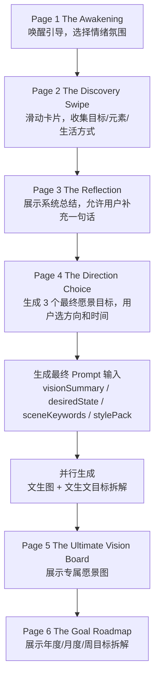
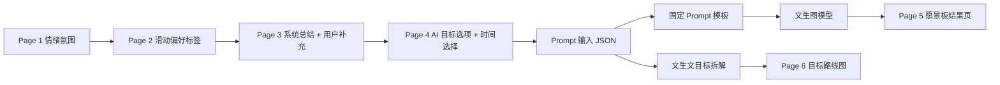
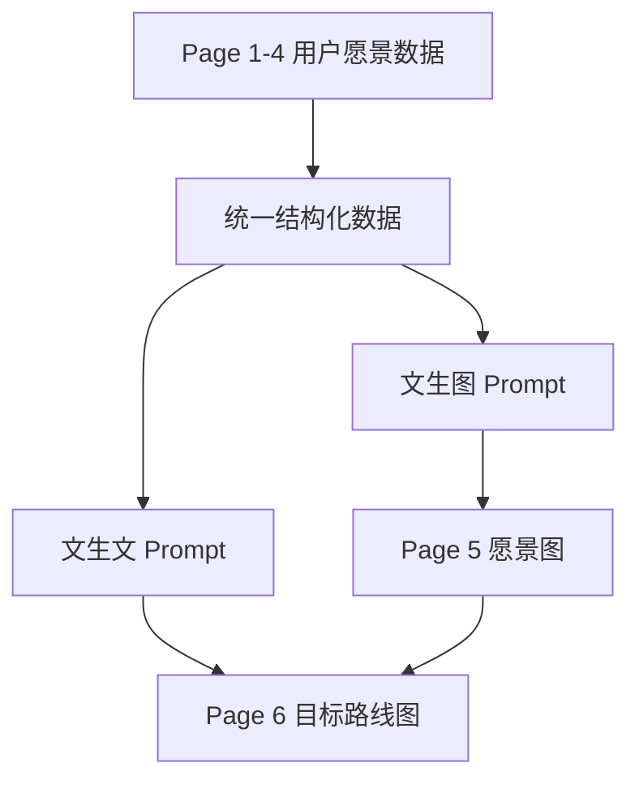

# 心愿愿景板交互流程 PRD

更新时间：2026-05-10

## 1. 背景

心愿愿景板产品希望通过一段轻量、温和、有陪伴感的交互，让用户从模糊的情绪和向往中，逐渐发现自己真正渴望的生活状态，并最终生成一张专属愿景板。

流程不是传统问卷，也不是任务管理工具。它更像一次“被引导的内在探索”：

```text
被唤醒 -> 凭直觉选择 -> 看见自己的偏好 -> 补充个人愿景 -> 确认最终目标 -> 生成专属愿景板
```

产品中的“小精灵 / 愿景向导”承担陪伴、反馈和解释的角色。它不强迫用户设定清晰 KPI，而是帮助用户把模糊感受收束成可视化愿景。

## 2. 产品目标

- 让用户在低压力状态下表达自己的渴望。
- 用滑动卡片收集偏好、生活方式、画面元素和潜在目标方向。
- 用系统总结帮助用户看见自己的关键信息。
- 允许用户补充一句自己的额外愿景。
- 让用户从 AI 生成的目标选项里确认最终方向和时间范围。
- 将最终方向转成文生图 Prompt 所需的结构化输入。
- 输出一张高质感、可保存、可反复打开查看的专属愿景板。

## 3. 页面总览

当前 MVP 流程包含 6 个页面：

1. Page 1：唤醒引导页 `The Awakening`
2. Page 2：愿景探索滑动页 `The Discovery Swipe`
3. Page 3：关键信息总结与补充页 `The Reflection`
4. Page 4：最终目标选择页 `The Direction Choice`
5. Page 5：专属愿景板结果页 `The Ultimate Vision Board`
6. Page 6：目标拆解结果页 `The Goal Roadmap`



## 4. 核心数据流



最终需要生成的 Prompt 输入结构：

```json
{
  "rawWish": "用户在流程中的选择和补充信息",
  "visionSummary": "A soft luxury wellness lifestyle with a confident, healthy, glowing future self.",
  "desiredState": "confident, calm, abundant, self-disciplined",
  "keywords": ["wellness", "soft luxury", "self-discipline", "freedom"],
  "sceneKeywords": ["morning sunlight", "pilates studio", "green smoothie", "ocean"],
  "stylePack": "clean-girl-luxury",
  "timeframe": "3 months",
  "focusAreas": ["探索周边的徒步路线", "为自己准备一周的健康早餐", "建立稳定的清晨节奏"],
  "roadmap": {
    "yearlyGoals": [],
    "monthlyMilestones": [],
    "weeklyActionItems": []
  },
  "aspectRatio": "16:9"
}
```

## 5. 导航与 Tab 设计

第一版不建议在前置流程中使用传统菜单栏 tab。

原因：

- Page 1-4 是一个逐步收束愿景的线性流程。
- 过早出现 tab 会让用户跳来跳去，削弱沉浸感。
- 用户在生成前不需要“浏览功能”，而是需要被引导完成表达。

推荐信息架构：

```text
Onboarding Flow
Page 1 引导
Page 2 滑动探索
Page 3 总结补充
Page 4 目标选择
↓
Result Workspace
Tab 1 愿景图
Tab 2 目标路线图
Tab 3 小精灵
```

### 前置流程导航

Page 1-4 使用线性导航：

- 顶部或底部展示轻量进度，例如 `1 / 4`。
- 可以使用小光点、进度线或小精灵位置变化表达进度。
- 不使用传统 tab。
- 允许必要的返回上一步，但不鼓励任意跳转。

### 结果页 Tab

Page 5 之后可以使用轻量 tab，因为用户已经拿到结果，此时产品从“生成流程”进入“愿景空间”。

建议结果页 tab：

| Tab | 对应内容 | 说明 |
| --- | --- | --- |
| 愿景图 / Vision | Page 5 | 展示生成图片、保存、重新生成 |
| 目标路线图 / Roadmap | Page 6 | 展示年度/月度/周目标、checkbox、进度条 |
| 小精灵 / Guide | 轻量对话 | 安慰、建议、调整目标、降低行动压力 |

结果页 tab 最多 3 个，不建议继续增加。

## 6. Page 1：唤醒引导页 The Awakening

### 页面目标

建立产品第一印象，用温和、神秘的方式把用户带入探索氛围，同时收集用户最初的情绪和氛围偏好。

### UI 视觉

- 极简深色或低饱和度背景。
- 屏幕中央悬浮一个有呼吸感的“发光光球 / 小精灵”。
- 小精灵是后续流程的陪伴角色。
- 小精灵下方浮现打字机文案。

### 交互逻辑

打字机文案示例：

```text
嗨，我是你的愿景向导。
今天感觉有点迷茫吗？
来看看你内心真正渴望什么。
```

用户点击屏幕后：

- 小精灵发光。
- 光球化作光迹。
- 展示情绪/氛围选择。
- 用户选择 2-4 个情绪词后进入 Page 2。

### 需要收集的信息

| 信息 | 示例 | 用途 |
| --- | --- | --- |
| `entryMoodHint` | curious, slightly lost, ready for self-discovery | 轻量上下文 |
| `mood` | 自信、松弛、富足、被爱、自由、治愈 | 进入 `desiredState` / `moodPrompt` |
| `atmosphere` | 明亮、梦幻、高级、轻盈、温暖、神秘 | 控制画面氛围 |

### 页面输出

```json
{
  "entryMoodHint": "curious, slightly lost, ready for self-discovery",
  "mood": ["confident", "abundant", "healing"],
  "atmosphere": ["bright", "soft luxury", "warm"]
}
```

## 7. Page 2：愿景探索滑动页 The Discovery Swipe

### 页面目标

通过极低门槛的直觉交互，捕捉用户潜意识里的渴望，并收集目标类别、画面元素和生活方式偏好。

用户不需要写文字，只需要对一组生活切片卡片做快速判断。滑动行为会被转化成偏好标签。

### UI 视觉

- 屏幕中央是卡片堆叠。
- 卡片展示高质感生活切片。
- 小精灵缩小，悬浮在角落陪伴。
- 用户向右滑表示喜欢，向左滑表示无感。

### 交互逻辑

- 右滑：喜欢，记录正向偏好标签。
- 左滑：无感，记录弱偏好或排除信号。
- 右滑时，小精灵发出温暖闪光，提供正反馈。
- 滑动完成后，系统自动提取用户偏好标签。

### 卡片类型

建议卡片分为 4 类，每类 4-8 张：

| 卡片类型 | 收集内容 | 示例 | 输出字段 |
| --- | --- | --- | --- |
| 目标类别卡 | 用户心愿大方向 | 健康、事业、财富、爱情、旅行、疗愈、学习 | `categorySignals` |
| 画面元素卡 | 生图中可出现的具体元素 | 海边、办公室、鲜花、咖啡、瑜伽垫、飞机窗 | `sceneKeywords` |
| 生活方式卡 | 用户向往的生活方式 | 清晨自律、远程办公、轻奢生活、稳定作息 | `lifestyleTags` |
| 状态价值卡 | 用户想成为怎样的人 | 有掌控感、被爱、自由、专业、稳定、闪闪发光 | `desiredStateSignals` |

### 推荐卡片内容

目标类别：

- 变美和健康
- 事业成功
- 财富增长
- 爱情和关系
- 旅行和自由
- 情绪疗愈
- 学习成长

画面元素：

- 晨光
- 鲜花
- 咖啡
- 飞机窗
- 海边
- 城市夜景
- 瑜伽垫
- 豪华酒店

生活方式：

- 清晨自律生活
- 海边远程办公
- 高级办公室工作
- 稳定健康作息
- 浪漫幸福日常

### 页面输出

```json
{
  "categorySignals": ["health", "beauty", "freedom"],
  "sceneKeywords": ["morning sunlight", "pilates studio", "green smoothie", "ocean"],
  "lifestyleTags": ["morning routine", "wellness lifestyle", "soft luxury"],
  "desiredStateSignals": ["confident", "glowing", "relaxed"],
  "avoidSignals": ["dark mood", "messy lifestyle", "corporate stress"]
}
```

## 8. Page 3：关键信息总结与补充页 The Reflection

### 页面目标

展示系统根据 Page 1 和 Page 2 得出的关键信息总结，让用户确认自己被理解，并允许用户补充一句自己的其他愿景。

这一页的核心是从“滑动选择”变成“具体描述”。它不是最终目标选择页，而是一个补充和校准页。

### UI 视觉

- 顶部：小精灵停留在页面上方。
- 中部：展示系统总结卡片。
- 下方：提供一个自由输入框。
- 底部：进入下一步按钮。

### 系统总结示例

```text
我看到你被清晨、健康、柔和的高级感吸引。
你似乎并不是单纯想变得更忙，
而是在寻找一种更轻盈、更自律、更有掌控感的生活。
```

### 用户补充问题

```text
还有什么你希望被放进这张愿景图里的愿望吗？
```

示例补充：

```text
我希望不要太网红，更自然一点，也希望有富足感。
```

### 需要收集的信息

| 信息 | 示例 | 用途 |
| --- | --- | --- |
| `reflectionSummary` | 系统总结出的偏好画像 | 生成 Page 4 目标选项 |
| `rawSupplement` | 用户补充的一句话 | 进入 `rawWish` / `keywords` |
| `avoid` | 不想太网红、不想太暗、不想像广告 | 进入 Prompt 避免项 |

### 页面输出

```json
{
  "reflectionSummary": "You are drawn to a soft luxury wellness lifestyle with morning light, calm confidence, and a sense of self-discipline.",
  "rawSupplement": "我希望不要太网红，更自然一点，也希望有富足感。",
  "avoid": ["too influencer-like", "cheap advertisement look"]
}
```

## 9. Page 4：最终目标选择页 The Direction Choice

### 页面目标

AI 根据前面所有信息，生成 3 个最终愿景目标选项。用户可以多选其中最有共鸣的方向，并选择达成目标所需要的时间。

这一页是生成图片前的最终确认页。

### UI 视觉

- 顶部：小精灵展示简短说明。
- 中部：展示 3 个高颗粒度目标方向条状选项卡。
- 下方：展示 3 个时间预设选项，并提供自定义时间输入框。
- 底部：展示“生成我的专属愿景”按钮。

### AI 目标选项要求

目标选项不应该是细碎任务，而是充满弹性、可想象的人生/年度向往。

示例：

```text
选项 A：找回身体的轻盈感与自然连接
选项 B：建立稳定、自律、发光的生活节奏
选项 C：拥有更富足、更松弛、更高级的日常状态
```

### 目标选项交互

目标选项建议使用“条状选项卡”，而不是大卡片。

原因：

- 条状选项信息密度更高，适合同时比较 3 个方向。
- 用户可以多选 1-2 个方向，表达复合愿景。
- 后续可以把多选结果合并成更丰富的 `visionSummary`。

交互规则：

- 默认不强制单选。
- 用户至少选择 1 个。
- 建议最多选择 2 个，避免愿景过散。
- 被选中的条状选项高亮。

输出字段：

```json
{
  "selectedVisionOptions": [
    "建立稳定、自律、发光的生活节奏",
    "拥有更富足、更松弛、更高级的日常状态"
  ]
}
```

### 时间选择

用户选择达成这个目标所需要的时间：

- 3 个月
- 6 个月
- 1 年

同时提供自定义输入框：

```text
其他时间：例如 45 天、半年内、毕业前、今年年底
```

时间字段优先级：

```text
customTimeframe > presetTimeframe
```

### 交互逻辑

- 用户选择 1-2 个最终愿景目标。
- 用户选择一个时间预设，或填写自定义时间。
- 用户点击“生成我的专属愿景”。
- 小精灵光芒覆盖全屏，进入 Loading。
- Loading 期间后端生成最终 Prompt，同时触发文生图和文生文目标拆解。

### 需要收集的信息

| 信息 | 示例 | 用途 |
| --- | --- | --- |
| `visionOptions` | 3 个 AI 目标方向 | 供用户选择 |
| `selectedVisionOptions` | 建立稳定、自律、发光的生活节奏；拥有更富足的日常状态 | 进入 `visionSummary` |
| `presetTimeframe` | 3 个月 | 进入 `timeframe` |
| `customTimeframe` | 今年年底 | 覆盖预设时间 |
| `timeframe` | 3 months | 进入 `goalOutcome` / 目标拆解 |
| `goalOutcome` | 建立稳定健康习惯 | 进入 Prompt |
| `desiredState` | 自信、健康、闪闪发光 | 进入 Prompt |
| `stylePack` | clean-girl-luxury | 进入 Prompt |

### 页面输出

```json
{
  "visionOptions": [
    "找回身体的轻盈感与自然连接",
    "建立稳定、自律、发光的生活节奏",
    "拥有更富足、更松弛、更高级的日常状态"
  ],
  "selectedVisionOptions": [
    "建立稳定、自律、发光的生活节奏",
    "拥有更富足、更松弛、更高级的日常状态"
  ],
  "presetTimeframe": "3 months",
  "customTimeframe": "",
  "timeframe": "3 months",
  "goalOutcome": "build a stable wellness and self-discipline routine within three months",
  "desiredState": "confident, healthy, glowing, self-controlled, abundant",
  "stylePack": "clean-girl-luxury"
}
```

## 10. Loading：愿景生成中

### 页面目标

承接用户点击生成后的等待时间，让模型生成过程不显得突兀。

### 交互逻辑

- 小精灵光芒覆盖全屏。
- 显示轻量文案：

```text
我正在把你的向往整理成一张图。
```

或：

```text
正在捕捉你未来生活里的光。
```

### 后端动作

Loading 期间完成：

1. 汇总 Page 1 的情绪氛围。
2. 汇总 Page 2 的偏好标签。
3. 合并 Page 3 的用户补充。
4. 读取 Page 4 的最终目标和时间范围。
5. 生成最终 `visionSummary`。
6. 选择或确认 `stylePack`。
7. 填入固定 Prompt 模板。
8. 调用文生图模型生成愿景图。
9. 调用文生文模型生成目标拆解。

## 11. Page 5：专属愿景板结果页 The Ultimate Vision Board

### 页面目标

这是最终交付页。它不是信息收集页，而是将抽象愿景具象化为高质感画面，并提供不焦虑、方向性的指引。

用户每次打开后，第一眼看到的应该是：

```text
这就是我想要靠近的生活。
```

### UI 视觉

视觉层 `The Why`：

- 占据主导位置的是 AI 生成的专属高质感大图或视频。
- 图片需要契合用户审美和目标。
- 图片应该可以保存为手机壁纸或愿景图。

灵感方向入口 `The Direction`：

- 画面下方或悬浮区域可以展示 1-3 个轻量方向提示。
- 不在这一页做完整目标拆解，完整拆解放到 Page 6。
- 提供“查看目标路线图”入口。

小精灵位置：

- 常驻右下角，作为 FAB。
- 用户可以点击它进行轻量对话。

### 灵感方向提示示例

如果用户大方向是：

```text
找回身体的轻盈感与自然连接
```

近期专注可以是：

- 探索周边的徒步路线
- 为自己准备一周的健康早餐
- 重新建立一个温柔的清晨节奏

如果用户大方向是：

```text
建立稳定、自律、发光的生活节奏
```

近期专注可以是：

- 为每天早晨留出 20 分钟安静时间
- 整理一个让自己想开始的运动空间
- 记录让身体状态变好的微小变化

### 交互逻辑

- 用户查看愿景图。
- 用户可以保存图片。
- 用户可以切换或重新生成风格。
- 用户点击“查看目标路线图”进入 Page 6。
- 用户点击右下角小精灵，进入轻量对话。

小精灵对话示例：

```text
用户：我这周感觉很累，不想动。
小精灵：那我们这周不追求推进，只做一件很轻的事：出门晒十分钟太阳，好吗？
```

### 页面输出

```json
{
  "imageUrl": "https://example.com/generated/vision-board.png",
  "selectedVisionOptions": [
    "建立稳定、自律、发光的生活节奏",
    "拥有更富足、更松弛、更高级的日常状态"
  ],
  "timeframe": "3 months",
  "focusAreas": [
    "为每天早晨留出 20 分钟安静时间",
    "整理一个让自己想开始的运动空间",
    "记录让身体状态变好的微小变化"
  ],
  "stylePack": "clean-girl-luxury"
}
```

## 12. Page 6：目标拆解结果页 The Goal Roadmap

### 页面目标

根据 Page 4 的最终目标、时间范围，以及生成图片时使用的 Prompt 信息，生成一个更可执行的目标路线图。

Page 6 是文生文结果页，和 Page 5 的文生图结果页互补：

- Page 5 解决“我想靠近什么样的生活”。
- Page 6 解决“我接下来可以怎么靠近它”。

### UI 结构

页面建议分为三层：

1. 年度目标 / 总目标
2. 月度目标 / 里程碑
3. 周目标 / Action Items

可以加入：

- Checkbox：用于周目标 action item。
- 进度条：根据已完成 action item 计算。
- 小精灵提示：用温和语气解释“只需要从一个很小的动作开始”。

### 目标拆解层级

| 层级 | 内容形式 | 颗粒度 | 是否可勾选 |
| --- | --- | --- | --- |
| 年度目标 / 总目标 | 1-3 个方向性目标 | 大方向，接近愿景 | 否 |
| 月度目标 / Milestones | 每月 1-3 个阶段性里程碑 | 中等颗粒度 | 可选 |
| 周目标 / Action Items | 每周 3-5 个轻量行动 | 具体可执行 | 是 |

### 示例结果

```json
{
  "yearlyGoals": [
    {
      "title": "建立稳定、自律、发光的生活节奏",
      "description": "让健康、自我照顾和富足感成为日常生活的一部分。"
    }
  ],
  "monthlyMilestones": [
    {
      "month": "Month 1",
      "title": "重新建立身体和生活秩序",
      "milestones": [
        "稳定每周 2-3 次轻运动",
        "建立一个可持续的清晨例行",
        "减少让自己感到混乱的生活习惯"
      ]
    },
    {
      "month": "Month 2",
      "title": "提升能量和自我照顾质量",
      "milestones": [
        "找到适合自己的运动方式",
        "优化饮食和睡眠节奏",
        "为自己创造更舒适的生活空间"
      ]
    },
    {
      "month": "Month 3",
      "title": "形成稳定而有质感的生活状态",
      "milestones": [
        "让自律变成自然习惯",
        "保持身体轻盈和情绪稳定",
        "持续靠近更自信、更富足的自己"
      ]
    }
  ],
  "weeklyActionItems": [
    {
      "title": "安排一次 30 分钟轻运动",
      "checked": false
    },
    {
      "title": "准备 3 天的健康早餐",
      "checked": false
    },
    {
      "title": "整理一个让自己想开始的运动角落",
      "checked": false
    }
  ],
  "progress": {
    "completed": 0,
    "total": 3,
    "percentage": 0
  }
}
```

### 交互逻辑

- 用户从 Page 5 点击“查看目标路线图”进入。
- 默认展开本周 action items。
- 用户勾选 action item 后，进度条更新。
- 年度和月度目标以 milestone 展示，不做强任务压力。
- 用户可以让小精灵“帮我把这周目标变轻一点”。

### 页面输出

```json
{
  "roadmapId": "roadmap_001",
  "yearlyGoals": [],
  "monthlyMilestones": [],
  "weeklyActionItems": [],
  "progress": {
    "completed": 0,
    "total": 3,
    "percentage": 0
  }
}
```

## 13. 从 Prompt 到文生图 / 文生文的交互设计

这一套产品生成链路分为两块：

1. 文生图：生成愿景板主视觉。
2. 文生文：生成目标拆解路线图。

两者应该使用同一份用户愿景数据，但交互重点不同。

### 文生图链路

用户感知：

```text
我选择了自己想要的生活状态 -> 系统帮我生成一张愿景图
```

后台链路：

```text
Page 1-4 数据 -> Prompt 输入 JSON -> 固定生图 Prompt 模板 -> 文生图模型 -> Page 5
```

交互建议：

- 在 Page 4 点击生成后，先进入 Loading。
- Loading 文案偏感性，不要说“正在调用接口”。
- Page 5 首屏先展示图片，文本信息少量露出。
- 图片生成失败时，可展示 Mock/兜底图，并提示稍后重新生成。
- Page 5 提供“换个风格再生成”入口。

### 文生文链路

用户感知：

```text
我看到了愿景图 -> 我想知道接下来可以怎么靠近它
```

后台链路：

```text
Page 1-4 数据 + 生图 Prompt + 最终目标 -> 文生文模型 -> 年度/月度/周目标 -> Page 6
```

交互建议：

- 文生文不一定要和图片完全同步展示，可以在 Page 5 后提供入口。
- Page 6 不要做传统待办列表，先呈现温和路线图。
- 年度/月度是 milestone，周目标才是 action item。
- 周目标应该轻量、可完成、可勾选。
- 勾选进度条不要制造压力，文案应强调“靠近一点就很好”。

### 两条链路的关系



建议体验顺序：

1. 先展示图，因为图是情绪奖励。
2. 再展示目标拆解，因为拆解是理性行动。
3. 不要让目标拆解抢走愿景图的情绪冲击。

## 14. 最终 Prompt 输入结构

在 Page 4 用户点击生成后，系统应合并前面所有信息，生成如下结构：

```json
{
  "rawWish": "我希望不要太网红，更自然一点，也希望有富足感。",
  "visionSummary": "A disciplined wellness lifestyle with a confident, healthy, glowing future self.",
  "selectedVisionOptions": [
    "建立稳定、自律、发光的生活节奏",
    "拥有更富足、更松弛、更高级的日常状态"
  ],
  "goalOutcome": "build a stable wellness and self-discipline routine within three months",
  "timeframe": "3 months",
  "desiredState": "confident, glowing, relaxed, self-disciplined, abundant",
  "keywords": ["wellness", "self-discipline", "soft luxury", "morning routine"],
  "sceneKeywords": ["morning sunlight", "pilates studio", "green smoothie", "white bedroom"],
  "stylePack": "clean-girl-luxury",
  "moodPrompt": "bright, clean, elegant, hopeful, abundant",
  "avoid": ["readable text", "logo", "dark mood", "messy collage", "too influencer-like"],
  "aspectRatio": "16:9"
}
```

## 15. Prompt 字段映射

| Prompt 字段 | 来源 | 说明 |
| --- | --- | --- |
| `rawWish` | Page 3 用户补充 + 前面选择结果 | 保留用户自己的愿望表达 |
| `selectedVisionOptions` | Page 4 用户多选的条状目标选项 | 作为最终愿景方向基础 |
| `visionSummary` | Page 4 目标选项合并总结 | 最重要字段，决定愿景图主题 |
| `goalOutcome` | Page 4 最终目标和时间范围 | 让目标更具体 |
| `timeframe` | Page 4 时间选择 | 用于目标总结，不一定直接影响画面 |
| `desiredState` | Page 1 情绪词 + Page 2 状态卡 + Page 4 AI 总结 | 决定图片情绪核心 |
| `keywords` | Page 1 + Page 2 + Page 3 | 抽象关键词，如 self-discipline、freedom、abundance |
| `sceneKeywords` | Page 2 画面元素卡 | 决定图片里出现的具体元素 |
| `stylePack` | Page 2 风格信号 + Page 4 推荐 | 决定整体审美 |
| `moodPrompt` | Page 1 情绪氛围 | 控制画面氛围 |
| `avoid` | Page 2 左滑卡片 + Page 3 用户修正 + 默认规则 | 避免用户不喜欢的方向 |
| `focusAreas` | Page 5 结果页 | 用于结果页轻量提示 |
| `roadmap` | Page 6 结果页 | 文生文目标拆解结果 |
| `aspectRatio` | 系统默认 | Web 端可用 `16:9`，手机壁纸可用 `9:16` |

## 16. MVP 建议

第一版最小可行方案：

- Page 1：小精灵引导 + 多选情绪词。
- Page 2：滑动选择目标类别、画面元素、生活方式。
- Page 3：展示系统总结，允许用户补充一句话。
- Page 4：生成 3 个最终愿景目标，用户多选 1-2 个并选时间。
- Loading：后端将最终数据填入固定 Prompt 模板并调用文生图接口。
- Page 5：展示生成图 + 3 个近期专注领域。
- Page 6：展示年度/月度/周目标拆解，周目标支持 checkbox 和进度条。

其中：

- Page 3 的系统总结可以先用规则模板生成。
- Page 4 的目标选项可以先用标签组合生成，后续再接 LLM。
- Page 6 的目标拆解可以先用模板生成，后续再接 LLM。
- 文生图 Prompt 使用固定模板。
- 小精灵聊天可以先不做，只保留入口。

## 17. 后续扩展

- 引入 LLM 生成更细腻的系统总结和目标选项。
- Page 2 卡片根据用户前几次滑动动态调整。
- Page 5 支持重新生成、保存壁纸、分享。
- Page 6 支持每周刷新行动项。
- 小精灵支持轻量对话和情绪陪伴。
- 结果页的 focus areas 后续可转成行动建议，但不做强任务管理。
